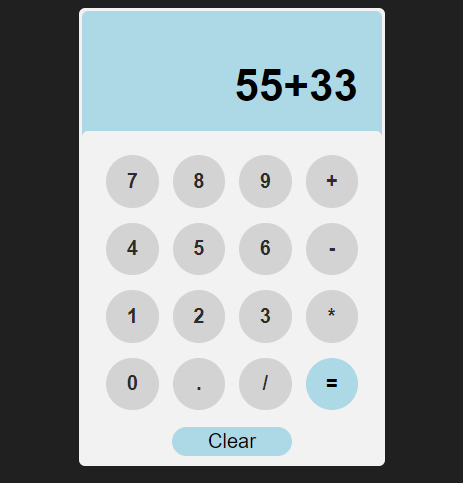

# Calculadora Web :1234:

  

## Descrição
Esta é uma aplicação web de calculadora simples que realiza operações aritméticas básicas (adição, subtração, multiplicação, divisão).

## Funcionalidades
- Visor de entrada para mostrar os números e operações digitadas.
- Botões para dígitos (0-9), ponto decimal (.), e operadores aritméticos (+, -, *, /).
- Botão "=" para calcular o resultado da expressão aritmética.
- Botão "Clear" para limpar o visor da calculadora.

## Como Usar
1. Digite os números e operadores utilizando os botões fornecidos.
2. Use o botão "Clear" para resetar o visor.
3. Pressione o botão "=" para ver o resultado da expressão aritmética digitada.

## Tecnologias Utilizadas
- HTML
- CSS
- JavaScript

## Instalação
1. Clone o repositório: `git clone https://github.com/seu-usuario/nome-do-repositorio.git`
2. Abra o arquivo `index.html` em seu navegador web.

## Contribuições
Contribuições são bem-vindas! Por favor, faça um fork do repositório e envie um pull request com suas melhorias.
